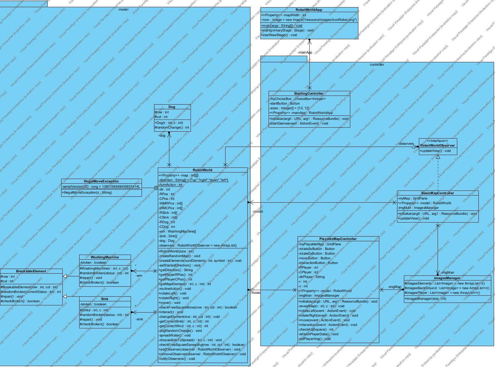
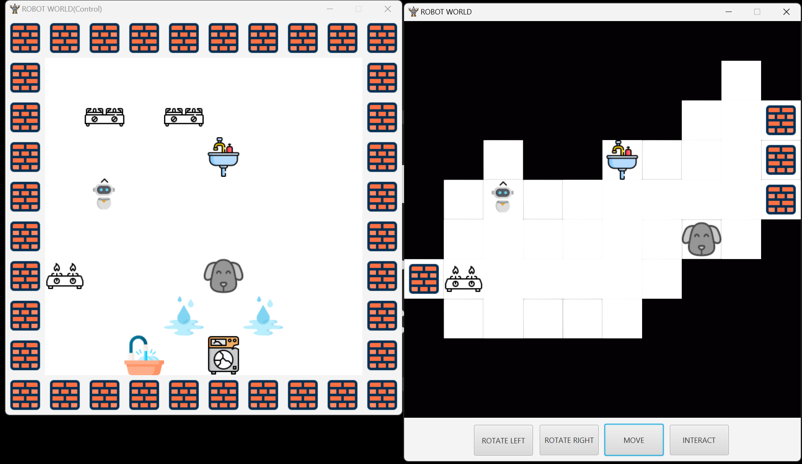

# robot-world
Simple JavaFX game of a robot moving within a square map with the possibility of various interactions.
## Introduction
The project is organized according to Model-View-Controller (MVC) logic. This approach allows for a clear separation of responsibilities among the various components of the software. Therefore, it is simple to describe the structure of the project and the various classes that compose it starting precisely from these 3 main components:
* Model: is the part of the software used to manage the various game data. It is composed of various classes, the main one of which is RobotWorld, which manages all the various essential components of the game, particularly the data regarding the game map, represented by an nxn matrix, and the various methods that allow its state to be changed from other parts of the application. The other classes that comprise it are the various elements that can be part of the game map, such as Sink, WashingMachine, and Dog. These elements were handled in the matrix used for map information with various symbols between 0 and 10 (commented in the various files).
* View: deals with the visual representation of the game to make it more usable for the user. For the development of this part I decided to use JavaFX through the use of .fxml files. In doing so I "drew", through the use of the SceneBuilder application, various sizes of initial maps(10x10 and 12x12), each in two versions: a PlayableMap for the game view and a BasicMap for the control view. Also implemented is a small StartingView that serves as the startup screen where the user can choose the size of the map they wish to play and thus launch the actual application.
* Controller: this last component is the most important part of the whole application, in fact it has the function of making the model and the view communicate. In particular, two main controllers have been implemented: a PlayableMapController to manage the playable map and a BasicMapController for the control map. Both classes have been linked directly to the view thus allowing the various events to be handled as a result of the user interacting with buttons in the playable map and updating the model accordingly

### Class Diagram

## Functionality
The developed game consists of a two-dimensional map of size 10x10 or 12x12 (user's choice) and allows the user to command a robot tasked with keeping the house tidy and clean through various interactions with objects. These objects are specifically: stoves, sinks, and dishwashers that randomly break by starting to leak water every few actions of the robot and the dog that at each turn moves or stays in its position. The actions that the robot can perform are mainly three:
1. Rotate left and right allowing the robot to turn 90 degrees in the chosen direction revealing the map around it. Allows it to turn completely in all directions
2.	Move in the directions in which it is turned forward one square. This action is only possible if the robot does not encounter a square already occupied by another map element or it is a wall (thus the limits of the map). Through movement the robot also cleans the various squares on the map (for example, from water) while revealing the map around it
3.	Interact with various objects in the map. In particular, the robot is allowed to: turn on/off stoves around the map so as to reveal the part of the map near it, repair/close washing machines or sinks

### An example of the map
On the left a control map, on the right the actual map for the game.

The robot's movements are restricted by the walls, which indicate the limits of the map, and of course by the various elements around the map. Should it attempt a 'move' action toward either of these elements a BUMP! warning comes out following the throwing of an exception.

The robot's interactions are limited by the presence or absence of interacting objects in its vicinity. In the case of the non-presence of them an error warning will come out indicating to the player the impossibility in carrying out the action.
## Contributing
Contribution to budget-app is welcome! If you have an idea for a new feature or bug fix, please open an issue or a pull request.